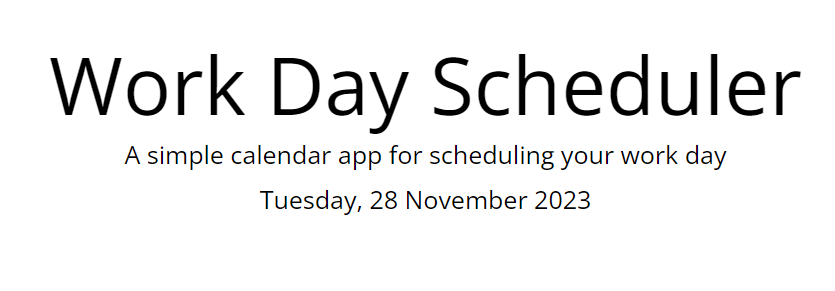
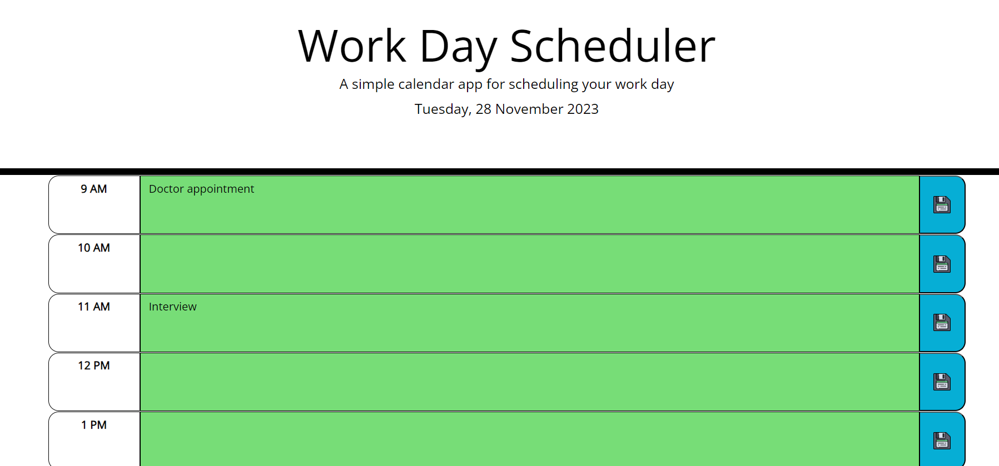
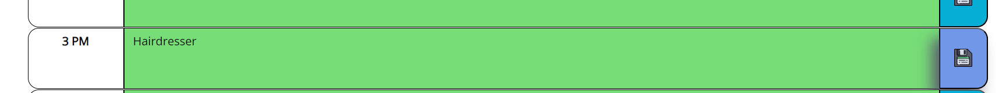

# Daily-Planner-App

Daily Planner Application

## Description

Daily Planner Application helps to keep your daily plans

## Installation

N/A

## Usage

The App Displays the current day at the top of the calendar when a user opens the planner.

Color-code each timeblock based on past, present, and future when the timeblock is viewed.

Allow users to make a note and save it when they click a button (save the event in local storage).

Persist events between refreshes of a page.

Updates will be available in the repository at the link:
https://github.com/Smileshum07/Daily-Planner-App

## Credits

N/A

## License

Please refer to the LICENSE in the repo
